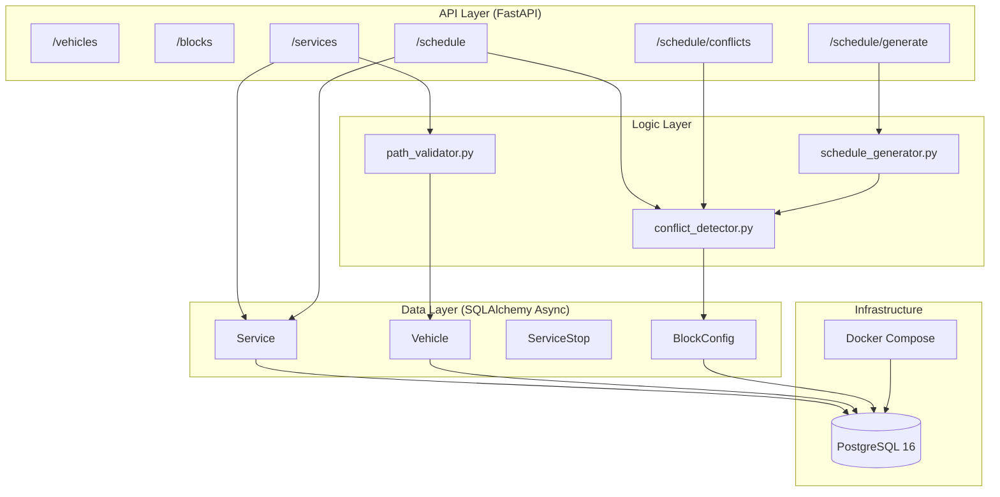

# 車輛調度系統 — 設計文件

## 目錄

1. [系統概覽](#1-系統概覽)
2. [技術選型與理由](#2-技術選型與理由)
3. [架構設計與評估](#3-架構設計與評估)
4. [軌道拓撲架構圖](#4-軌道拓撲架構圖)
5. [資料模型設計](#5-資料模型設計)
6. [API 端點設計](#6-api-端點設計)
7. [核心邏輯設計與評估](#7-核心邏輯設計與評估)
8. [測試設計與評估](#8-測試設計與評估)
9. [Code Review 發現與重構紀錄](#9-code-review-發現與重構紀錄)
10. [複雜度分析與擴充策略](#10-複雜度分析與擴充策略)

---

## 1. 系統概覽

本系統為固定軌道網絡上的車輛調度後端服務，提供：

- 車輛與服務（行程）的 CRUD 管理
- 路徑合法性驗證（基於有向圖）
- 衝突偵測（軌道佔用、連鎖區段、電池）
- 自動排班生成（無衝突貪婪演算法）

系統不含前端，純 REST API 設計。

---

## 2. 技術選型與理由

| 技術 | 選擇 | 理由 |
|------|------|------|
| 語言 | Python 3.13 | 作業規範；typing 支援完整 |
| Web Framework | FastAPI | 原生 async、自動 OpenAPI 文件、Pydantic v2 整合 |
| ORM | SQLAlchemy 2.x async | 型別安全 Mapped 欄位、async session、關係 eager loading |
| 資料庫 | PostgreSQL 16 | 支援 `ON CONFLICT DO NOTHING` upsert；生產級可靠性 |
| 資料驗證 | Pydantic v2 | `model_validator`、`BaseSettings`；效能比 v1 提升顯著 |
| 遷移工具 | Alembic | 與 SQLAlchemy 整合、async 遷移支援 |
| 套件管理 | uv | 比 pip 快 10-100x；`uv.lock` 確保可重現建構 |
| Linting/Formatting | ruff | 單一工具取代 flake8+isort+pyupgrade；速度極快 |
| 容器化 | Docker Compose | `db` + `api` 服務；healthcheck 確保啟動順序 |

**為何不用 Django REST Framework？** FastAPI 的 async-first 設計與本系統 IO 密集型需求更匹配；DRF 的同步 ORM 在高並發時有瓶頸。

**為何不用 SQLite？** 生產部署需要 PostgreSQL 特有功能（upsert、timezone-aware datetime、並發寫入安全性）。

---

## 3. 架構設計與評估

### 3.1 系統分層架構

```
┌─────────────────────────────────────────────────────┐
│                   HTTP Client                        │
└──────────────────────┬──────────────────────────────┘
                       │ REST API
┌──────────────────────▼──────────────────────────────┐
│                  FastAPI Routers                      │
│  /vehicles  /blocks  /services  /schedule  /conflicts│
└──────────────────────┬──────────────────────────────┘
                       │
┌──────────────────────▼──────────────────────────────┐
│                  Business Logic                       │
│  path_validator.py  conflict_detector.py             │
│  schedule_generator.py                               │
└──────────────────────┬──────────────────────────────┘
                       │
┌──────────────────────▼──────────────────────────────┐
│              SQLAlchemy Async ORM                     │
│  Vehicle  Service  ServiceStop  BlockConfig           │
└──────────────────────┬──────────────────────────────┘
                       │
┌──────────────────────▼──────────────────────────────┐
│              PostgreSQL 16 (Docker)                   │
└─────────────────────────────────────────────────────┘
```

### 3.2 架構評估標準與決策

**關注點分離（Separation of Concerns）**

路由層只負責 HTTP 請求/回應的序列化；邏輯層（`logic/`）完全不依賴 HTTP；資料模型與查詢邏輯集中在 ORM 層。這使得邏輯層可以獨立進行純 Python 單元測試，無需啟動資料庫。

**純函數設計**

`detect_block_conflicts`、`detect_battery_conflicts`、`validate_path` 全部設計為純函數：輸入固定資料結構，輸出結果，無副作用。好處：
- 單元測試直接傳入資料，不需 mock
- 衝突偵測邏輯可在任何上下文重用（API、排班生成器、CLI）

**依賴注入**

FastAPI 的 `Depends(get_db)` 確保每個請求使用獨立的 `AsyncSession`，避免跨請求狀態汙染，也便於測試時替換資料庫連線。

**硬編碼拓撲**

軌道圖（`topology.py`）硬編碼為 Python 常數（`Final`），而非存入資料庫。評估：
- ✅ 圖在作業範圍內固定不變，不需動態修改
- ✅ 任何地方 import 即可使用，無 DB 查詢開銷
- ✅ 型別安全，IDE 可直接追蹤
- ⚠️ 若未來需要動態修改拓撲，需重構為 DB 存儲（但超出本作業範圍）

---

## 4. 軌道拓撲架構圖

### 4.1 Adjacency List（規格原文）

`->`：單向；`<- X ->`：雙向。與 [app/topology.py](app/topology.py) 的 `ADJACENCY` 一對一對應。

```
Y  <- B1  -> P1A
Y  <- B2  -> P1B
P1A -> B3  -> B5  -> P2A
P1B -> B4  -> B5  -> P2A
P2A -> B6  -> B7  -> P3A
P2A -> B6  -> B8  -> P3B
P3A -> B10 -> B11 -> P2B
P3B -> B9  -> B11 -> P2B
P2B -> B12 -> B14 -> P1B
P2B -> B12 -> B13 -> P1A
```

**結構重點**：

- **Y ↔ S1 雙向**：B1 / B2 兩條平行雙向軌，車輛可從 Y 出發也可返回 Y。
- **S1 → S2 → S3 → S2 → S1 單向迴圈**：出發段 B3/B4 在 B5 匯流、B6 在 B7/B8 分流；回程段 B9/B10 在 B11 匯流、B12 在 B13/B14 分流。
- **平台對稱**：P1A 與 P1B 都同時是進入 S1 與離開 S1 的節點（並非「出站 / 入站」的分工），P2A / P2B 與 P3A / P3B 同理。

### 4.2 互鎖群組說明

| 群組 | 成員 | 語意 |
|------|------|------|
| 群組 1 | B1, B2 | Y ↔ S1 的兩條平行雙向軌 |
| 群組 2 | B3, B4, B13, B14 | S1 匯流（B3/B4）與分流（B13/B14）集中在同一交叉區 |
| 群組 3 | B7, B8, B9, B10 | S3 分流（B7/B8）與匯流（B9/B10）集中在同一交叉區 |

**非互鎖區塊**（B5, B6, B11, B12）雖不屬於任何互鎖群組，但仍禁止兩輛車同時佔用同一區塊（同區塊佔用規則，見 §7.2）。

### 4.3 系統層架構圖（Mermaid）



---

## 5. 資料模型設計

### 5.1 ER Diagram

```
vehicles
├── id          SERIAL PK
├── name        VARCHAR(100) UNIQUE NOT NULL
└── battery_level FLOAT DEFAULT 80 CHECK(0..100)
        │
        │ 1:N
        ▼
services
├── id          SERIAL PK
├── vehicle_id  FK → vehicles.id NOT NULL
├── created_at  TIMESTAMPTZ DEFAULT now()
└── updated_at  TIMESTAMPTZ DEFAULT now()
        │
        │ 1:N (cascade delete)
        ▼
service_stops
├── id           SERIAL PK
├── service_id   FK → services.id ON DELETE CASCADE NOT NULL
├── sequence     INTEGER NOT NULL
├── node_id      VARCHAR(10) NOT NULL
├── arrival_time TIMESTAMPTZ (NULL for block nodes)
└── departure_time TIMESTAMPTZ (NULL for block nodes)
UNIQUE(service_id, sequence)
INDEX(service_id)

block_configs
├── block_id          VARCHAR PK ("B1".."B14")
└── traversal_seconds INTEGER DEFAULT 60
```

### 5.2 設計決策說明

**為何 service_stops 存所有節點（含區塊）？**

區塊只存 `node_id` 和 `sequence`，時間由 `BlockConfig.traversal_seconds` 動態計算。這避免了時間資料雙重維護：若 traversal 時間更新，衝突偵測自動反映新值，不需更新歷史行程資料。

**`UniqueConstraint("service_id", "sequence")`**

防止同一行程中序號重複寫入（例如並發請求或程式錯誤）。在資料庫層保障資料完整性，比純應用層驗證更可靠。

**`Index("ix_service_stops_service_id")`**

`GET /schedule` 和衝突偵測都需要以 service_id 批量載入 stops，此索引將查詢從 O(N) 掃描降為 O(log N) + sequential 存取。

**`Index("ix_services_vehicle_id")`**

支援「列出某輛車的所有行程」查詢，也是 JOIN 優化路徑。

**區塊時間為何不存入 DB？**

若存入，每次修改 `traversal_seconds` 都需要回填所有歷史行程的區塊時間。動態計算讓 `BlockConfig` 成為單一事實來源（single source of truth）。

### 5.3 領域常數（電池模型）

所有電池相關常數集中在 [app/topology.py](app/topology.py)，以 `Final` 宣告避免被覆寫：

| 常數 | 值 | 單位 | 意義 |
|------|----|------|------|
| `BATTERY_INITIAL` | 80.0 | % | 車輛出廠 / 預設起始電量 |
| `BATTERY_MAX` | 100.0 | % | 滿電上限 |
| `BATTERY_MIN_DEPARTURE` | 80.0 | % | 服務出發門檻；低於則觸發 `INSUFFICIENT_CHARGE` |
| `BATTERY_THRESHOLD` | 30.0 | % | 低電量警戒線；在回到 Y 之前掉到此線以下觸發 `LOW_BATTERY` |
| `BATTERY_COST_PER_BLOCK` | 1.0 | % / block | 通過一個 block 扣 1% |
| `BATTERY_CHARGE_RATE` | 1/12 | % / sec | 在 Y 停留期間的充電速率 |
| `BATTERY_BASELINE_EPOCH` | 1970-01-01 UTC | — | BASELINE ledger event 的 `occurred_at`；確保任何現實排班 `start_time` 都在其之後 |

**電池行為模型**：
- 通過每個 block 扣 `BATTERY_COST_PER_BLOCK`。
- `departure_battery` = `battery_before(start_time)` + 本次排班產生的 `YARD_CHARGE` delta（ledger 投影，見 [app/logic/battery.py](app/logic/battery.py) 與 [app/logic/snapshots.py](app/logic/snapshots.py)）。
- 自動排班生成器（Bonus 3）在每個 slot 前依據車輛上一趟結束後在 Y 停留的秒數 × `BATTERY_CHARGE_RATE` 計算充電量，capped 到 `BATTERY_MAX`，落成 `YARD_CHARGE` event。手動建立的 service 不自動充電（呼叫端自行 PATCH `battery_level` 或等待前一筆 service 的 consume 再重算）。
- `DEFAULT_ROUND_TRIP` 經過 10 個 block，預估耗電 10%；搭配出發門檻 80%，結束電量約 70% > 30%，在預設配置下恆合法。

---

## 6. API 端點設計

### 6.1 端點清單

```
GET    /api/v1/vehicles              列出所有車輛
POST   /api/v1/vehicles              建立車輛
GET    /api/v1/vehicles/{id}         取得單一車輛

GET    /api/v1/blocks                列出所有區塊設定
PUT    /api/v1/blocks/{block_id}     更新區塊通行時間

GET    /api/v1/services              列出所有行程
POST   /api/v1/services              建立行程（含路徑驗證）
GET    /api/v1/services/{id}         取得單一行程
PUT    /api/v1/services/{id}         更新行程
DELETE /api/v1/services/{id}         刪除行程

GET    /api/v1/schedule              依出發時間排序的完整排班
GET    /api/v1/schedule/conflicts    偵測所有衝突
POST   /api/v1/schedule/generate     自動生成無衝突排班

GET    /api/v1/topology              拓撲圖 + 區塊時間 + 電池常數（Bonus 2 後端）
GET    /api/v1/topology/positions    指定時刻所有車輛位置 + 電量（Bonus 2 後端）
```

### 6.2 設計評估

**路徑驗證在寫入時進行（Fail Fast）**

`POST /services` 和 `PUT /services/{id}` 在持久化前呼叫 `validate_path`，確保資料庫中不存在非法路徑。422 錯誤回傳具體的錯誤訊息陣列，方便客戶端定位問題。

**寫入端衝突：擋 vs. 回報的分割**

衝突類型依「是否違反單車物理可能性」切成兩組：

| 類型 | 能否共存？ | 處理方式 |
|------|-----------|---------|
| `VEHICLE_OVERLAP` | ❌ 同台車不可能同時在兩處 | `POST/PUT /services` 直接 409 擋下 |
| `VEHICLE_DISCONTINUITY` | ❌ 車輛不會瞬移 | `POST/PUT /services` 直接 409 擋下 |
| `INTERLOCKING`（跨服務） | ⚠️ 多車排程可協調 | 不擋；`GET /schedule/conflicts` 回報 |
| `LOW_BATTERY` / `INSUFFICIENT_CHARGE` | ⚠️ 電池狀態可變 | 不擋；回報 |

[app/routers/services.py](app/routers/services.py) 的 `WRITE_TIME_CONFLICTS` 集合明確列出 fail-fast 的類型，未來新增衝突時必須顯式決定歸屬，避免默默歸錯組。

**權衡**：這個切分來自 code review — 最初所有衝突都只在 GET 端點回報，導致使用者能建立「同車重疊」這種物理不可能的資料。完全擋下所有衝突又會讓手動調度無從下手（常需要暫時性多車衝突）。最終以「單車不變量 vs. 跨車可調度」為準。

**`/schedule` 與 `/services` 分離**

`/services` 回傳原始資料（依 ID 排序），`/schedule` 回傳依出發時間排序的視圖。關注點分離，且 `/schedule` 可未來擴充篩選、分頁等功能。

### 6.3 Request / Response 範例

以下範例對應 [app/schemas/service.py](app/schemas/service.py) 與 [app/schemas/block_config.py](app/schemas/block_config.py) 的目前實作。時間統一 timezone-aware（UTC），block 節點 `arrival_time` / `departure_time` 必須為 `null`（帶值回 422）。

#### POST `/api/v1/services` — 建立行程

Request：

```json
{
  "vehicle_id": 1,
  "stops": [
    {"sequence": 0, "node_id": "Y",   "departure_time": "2026-04-18T08:00:00Z"},
    {"sequence": 1, "node_id": "B1"},
    {"sequence": 2, "node_id": "P1A", "arrival_time": "2026-04-18T08:01:00Z",
                                       "departure_time": "2026-04-18T08:01:30Z"},
    {"sequence": 3, "node_id": "B3"},
    {"sequence": 4, "node_id": "B5"},
    {"sequence": 5, "node_id": "P2A", "arrival_time": "2026-04-18T08:03:30Z",
                                       "departure_time": "2026-04-18T08:04:00Z"}
  ]
}
```

Response 201：

```json
{
  "id": 7,
  "vehicle_id": 1,
  "created_at": "2026-04-18T07:59:01.123Z",
  "updated_at": "2026-04-18T07:59:01.123Z",
  "stops": [
    {"id": 31, "sequence": 0, "node_id": "Y",   "arrival_time": null,
                                                 "departure_time": "2026-04-18T08:00:00Z"},
    {"id": 32, "sequence": 1, "node_id": "B1",  "arrival_time": null, "departure_time": null},
    ...
  ]
}
```

錯誤：

- 422：路徑非法 / block stop 帶 time / stops 未依 sequence 排序 — `{"detail": [...]}`
- 409：同台車時間重疊或位置不連續（`VEHICLE_OVERLAP` / `VEHICLE_DISCONTINUITY`）
- 404：`vehicle_id` 不存在

#### GET `/api/v1/schedule` — 排班視圖

Response 200（依第一筆有 `departure_time` 的 stop 排序）：

```json
[
  {"id": 3, "vehicle_id": 1, "created_at": "...", "updated_at": "...",
   "stops": [{"sequence": 0, "node_id": "Y", "departure_time": "2026-04-18T08:00:00Z", ...}, ...]},
  {"id": 7, "vehicle_id": 2, "created_at": "...", "updated_at": "...",
   "stops": [{"sequence": 0, "node_id": "Y", "departure_time": "2026-04-18T08:05:00Z", ...}, ...]}
]
```

無服務時回空陣列 `[]`。

#### PUT `/api/v1/blocks/{block_id}` — 更新區塊通行時間

Request（`block_id` 路徑參數為 `B1`..`B14`）：

```json
{ "traversal_seconds": 75 }
```

Response 200：

```json
{ "block_id": "B5", "traversal_seconds": 75 }
```

錯誤：

- 422：`traversal_seconds <= 0`
- 404：`block_id` 不在 `B1`..`B14`

**副作用**：此值是衝突偵測與排班生成的唯一事實來源，更新後再呼叫 `GET /schedule/conflicts` 會以新值重新計算，不需回填歷史 stops（見 §5.2）。

#### GET `/api/v1/schedule/conflicts` — 衝突偵測

Response 200：

```json
[
  {
    "conflict_type": "interlocking",
    "service_ids": [3, 7],
    "description": "Services 3 and 7 occupy interlocking group {B3, B4} at overlapping times"
  },
  {
    "conflict_type": "vehicle_overlap",
    "service_ids": [10, 12],
    "description": "Vehicle 2 services 10 and 12 overlap in time"
  },
  {
    "conflict_type": "low_battery",
    "service_ids": [15],
    "description": "Vehicle 3 would drop below 30% before returning to yard"
  }
]
```

`conflict_type` 值域：`interlocking` / `low_battery` / `insufficient_charge` / `vehicle_overlap` / `vehicle_discontinuity`（見 [app/logic/conflict_detector.py](app/logic/conflict_detector.py) `ConflictType`）。無衝突回空陣列。

#### POST `/api/v1/schedule/generate` — 自動排班（Bonus 3）

Request：

```json
{
  "start_time": "2026-04-18T08:00:00Z",
  "end_time":   "2026-04-18T10:00:00Z",
  "departure_interval_minutes": 10,
  "platform_dwell_seconds": 30,
  "vehicle_ids": [1, 2, 3]
}
```

Response 201：回傳新建立的 `ServiceRead` 陣列，格式同 `POST /services` 的 response。三輛車會以 `10 / 3 ≈ 3.33 分鐘` offset 錯開首次出發。

錯誤：

- 422：`end_time <= start_time`、`departure_interval_minutes <= 0`、時間非 timezone-aware、或乘客等待保證失敗（相鄰 departure 差 > interval）
- 404：`vehicle_ids` 有不存在的 ID

#### GET `/api/v1/topology` — 靜態圖 + 動態 block 時間 + 電池常數

Response 200：

```json
{
  "yard": "Y",
  "platforms": [
    {"id": "P1A", "station": "S1"},
    {"id": "P1B", "station": "S1"}
  ],
  "blocks": [
    {"id": "B1", "traversal_seconds": 60, "interlocking_group_id": 1, "bidirectional": true},
    {"id": "B5", "traversal_seconds": 60, "interlocking_group_id": null, "bidirectional": false}
  ],
  "interlocking_groups": [
    {"id": 1, "blocks": ["B1", "B2"]},
    {"id": 2, "blocks": ["B3", "B4", "B13", "B14"]},
    {"id": 3, "blocks": ["B7", "B8", "B9", "B10"]}
  ],
  "edges": [
    {"from": "Y",  "to": "B1"},
    {"from": "B1", "to": "P1A"},
    {"from": "B1", "to": "Y"}
  ],
  "battery": {
    "initial": 80.0, "max": 100.0, "min_departure": 80.0,
    "threshold": 30.0, "cost_per_block": 1.0, "charge_rate_per_second": 0.0833
  }
}
```

`traversal_seconds` 反映當下 `block_configs` 值；更新 `PUT /blocks/{id}` 後下一次 `GET /topology` 即生效。

#### GET `/api/v1/topology/positions?at=<iso8601>` — 指定時刻全車位置

Response 200：

```json
[
  {
    "vehicle_id": 1,
    "status": "traversing_block",
    "current_node": "B5",
    "next_node": "P2A",
    "service_id": 7,
    "enter_time": "2026-04-18T08:02:00Z",
    "exit_time":  "2026-04-18T08:03:00Z",
    "battery_level": 78.5
  },
  {
    "vehicle_id": 2,
    "status": "idle",
    "current_node": "P1A",
    "next_node": null,
    "service_id": null,
    "enter_time": null,
    "exit_time": null,
    "battery_level": 79.0
  }
]
```

`status` 列舉：`idle` / `at_yard` / `at_platform` / `traversing_block`。

**電量計算**：`battery_level = max(0, vehicle.battery_level − cost_at(at))`
- 已結束 block（`exit_time <= at`）：扣 1 單位 / 每個 block。
- 正在通過的 block：線性內插 `cost_per_block × elapsed_in_block / traversal_seconds`。

**IDLE 的 `current_node`**：取該車所有 stops 中 `exit_time <= at` 且最晚結束的 stop 的 node；若該車從未出過勤 → `"Y"`。

錯誤：
- 422：`at` 為 naive datetime（無 timezone）或無法 parse。

---

## 7. 核心邏輯設計與評估

### 7.1 路徑驗證（`path_validator.py`）

**設計**：`validate_path(nodes: list[str]) -> list[str]` 回傳所有錯誤訊息（空列表 = 合法）。

**評估標準**：
1. 所有節點必須存在於 `ALL_NODES`
2. 每對相鄰節點必須在 `ADJACENCY` 中存在有向邊
3. 路徑長度 ≥ 2

**為何回傳 list 而非 bool？**

多個錯誤可以一次全部回傳，客戶端不需要逐一修正後重試。

### 7.2 衝突偵測（`conflict_detector.py`）

#### 區塊佔用衝突（兩層規則）

```
規則 1（同區塊）：任意兩行程在同一區塊時間重疊 → INTERLOCKING 衝突
規則 2（互鎖群組）：任意兩行程在同一互鎖群組的不同區塊時間重疊 → INTERLOCKING 衝突
```

**關鍵設計決策**：規則 1 適用於所有區塊（含 B5, B6, B11, B12），而非只有互鎖群組內的區塊。初始實作只有規則 2，導致非互鎖區塊的同時佔用無法被偵測（Bug 修正）。

**時間重疊判斷**：使用半開區間 `[enter, exit)`，即 `a_enter < b_exit AND b_enter < a_exit`，確保首尾相接的行程不被誤判為衝突。

#### 同車多服務衝突（VEHICLE_*）

- **VEHICLE_OVERLAP**：同一台車的兩個服務時間窗重疊 → 物理不可能。
- **VEHICLE_DISCONTINUITY**：同一台車相鄰服務的終點 ≠ 次服務起點 → 車輛瞬移。

`detect_vehicle_conflicts` 先依 `vehicle_id` 分組，再以 `(first_enter, last_exit)` 排序後兩兩比對時間窗；若已偵測到 overlap，就跳過連續性檢查（避免同一對服務產出兩個重複衝突）。

這兩個類型是 code review 時才補上的：原本 `detect_conflicts` 只看跨車 INTERLOCKING，不區分 vehicle_id，所以單車重疊 / 瞬移完全被放過。補完後連同寫入端 fail-fast 一起生效（見 §6.2）。

#### 電池衝突（兩種類型）

| 類型 | 觸發條件 | ConflictType |
|------|---------|--------------|
| 出發電量不足 | `departure_battery < 80` | `INSUFFICIENT_CHARGE` |
| 電量耗盡風險 | 電量 < 30 且後續無法回到 Y | `LOW_BATTERY` |

**`_yard_reachable_after` 的索引設計**

使用 `stops[current_index + 1:]` 切片而非節點名稱搜尋。若同一路徑有兩段 B1（往返），名稱搜尋會找到第一個 B1，看到其後有 Y 就誤判為可達。索引切片確保只看當前位置之後的路徑。

### 7.3 自動排班生成（`schedule_generator.py`）

**演算法**：貪婪（Greedy），多車輛以 `interval / N` 錯開。

```
interval = departure_interval_minutes
offset   = interval / len(vehicles)
for i, vehicle in enumerate(vehicles):
    slot = start_time + offset * i
    while slot + round_trip_duration <= end_time:
        candidate = compute_stops(DEFAULT_ROUND_TRIP, slot, block_cfg, dwell)
        if no INTERLOCKING / VEHICLE_* conflict vs. committed:
            persist, append to committed snapshots
        slot += interval
verify: per-platform 相鄰出發時間差 ≤ interval（乘客等待保證）
```

**關鍵設計決策**：

- **多車 offset（`interval / N`）**：code review 前版本所有車輛都從 `start_time` 同時出發，彼此立刻互相衝突、大部分 candidate 被拒絕；而且乘客等待時間會集中在班距的一端。錯開後每個 interval 視窗內 N 輛車均勻出發。
- **乘客等待檢查（Bonus 3 硬需求）**：事後在每個 platform 檢查相鄰 departure 時間差 ≤ `interval`。若失敗整個交易 rollback，回 422 建議「縮小 interval 或增加車輛」。這個檢查原本缺失，導致 interval 設得過大或車不夠時，生成結果看起來沒衝突但實際違反等待保證。
- **Router 負責 commit**：`generate_schedule` 只呼叫 `flush()`，交易邊界由 [app/routers/schedule.py](app/routers/schedule.py) 的 `auto_generate_schedule` 持有。原本 generator 內部自行 commit — 違反分層（logic 層不該碰交易邊界），也讓後續新增的 passenger wait 檢查沒有辦法 rollback 已產生的資料。
- **輸入驗證集中在 Pydantic**：`GenerateRequest` 的 `model_validator` 保證 `end_time > start_time` 且兩個時間皆 timezone-aware；`vehicle_ids` 缺失時 404 而非部分成功。

**評估**：
- ✅ 實作簡單、可理解、易測試
- ✅ 保證無 INTERLOCKING / VEHICLE_* 衝突（每次插入前驗證）
- ✅ 乘客等待保證以 post-check 表達，邏輯明確
- ⚠️ 非最優：無回溯；早期 slot 壓縮後期可用性時無法調整
- ⚠️ 固定路徑（`DEFAULT_ROUND_TRIP`），未來可擴充為動態選路

**為何只檢查區塊衝突而非電池衝突？**

自動生成使用固定路徑，電池消耗可預知且在標準配置下始終合規（初始電量 80，`DEFAULT_ROUND_TRIP` 經過 10 個 block 消耗 10 單位，結束電量 70 > 30）。若路徑或電量設定改變，應加入電池衝突檢查。

---

## 8. 測試設計與評估

### 8.1 測試策略

```
tests/
├── conftest.py               — 共用 fixtures（Postgres container、client、自動 truncate）
├── test_path_validator.py    — 純邏輯單元測試（無 DB）
├── test_conflict_detector.py — 純邏輯單元測試（無 DB）
├── test_services_api.py      — API 整合測試（真實 PostgreSQL）
└── test_schedule_generator.py — 自動排班整合測試（真實 PostgreSQL）
```

**分層設計理由**：

邏輯層（`logic/`）完全不依賴資料庫，因此單元測試無需啟動 DB，速度快且隔離性高。API 層的整合測試以 testcontainers 啟動 `postgres:16-alpine`，跑真實 `alembic upgrade head` 套用 schema，確認 timezone / cascade / unique constraint 等 PG 語意與 prod 一致。基礎設施細節見 §8.3。

### 8.2 衝突偵測測試設計

#### 區塊衝突測試矩陣

| 測試案例 | 覆蓋場景 |
|---------|---------|
| `test_no_conflict_non_overlapping_same_group` | 時間不重疊，互鎖群組內 |
| `test_conflict_interlocking_group1_b1_b2` | 群組 1 跨區塊衝突 |
| `test_conflict_interlocking_group2_b3_b4` | 群組 2 跨區塊衝突 |
| `test_conflict_interlocking_group3_b7_b10` | 群組 3 跨區塊衝突 |
| `test_no_conflict_blocks_in_different_groups` | 不同群組可自由重疊 |
| `test_touching_but_not_overlapping` | 邊界條件：首尾相接 |
| `test_multiple_group_conflicts` | 單一排班有多個衝突 |
| `test_conflict_same_block_non_interlocked_b5` | 非互鎖區塊同時佔用 |
| `test_conflict_same_block_non_interlocked_b6` | 非互鎖區塊同時佔用 |
| `test_conflict_same_block_non_interlocked_b11` | 非互鎖區塊同時佔用 |
| `test_conflict_same_block_non_interlocked_b12` | 非互鎖區塊同時佔用 |
| `test_no_conflict_same_non_interlocked_block_non_overlapping` | 非互鎖時間不重疊 |
| `test_same_service_sequential_same_block_no_conflict` | 同行程往返同區塊 |

#### 電池衝突測試矩陣

| 測試案例 | 覆蓋場景 |
|---------|---------|
| `test_sufficient_charge_no_conflict` | 電量充足，無衝突 |
| `test_insufficient_charge_at_departure` | 出發電量 < 80 |
| `test_exactly_at_min_departure_no_conflict` | 恰好等於 80，合法 |
| `test_low_battery_no_yard_after` | 電量 < 30 且後無 Y |
| `test_low_battery_yard_present_after_no_conflict` | 電量 < 30 但後有 Y |
| `test_yard_reachable_after_uses_index_not_node_name` | 索引切片正確性驗證 |

最後一個測試案例特別重要：直接測試 `_yard_reachable_after` 的索引行為，而非通過完整電池流程間接驗證，確保實作細節正確。

#### API 整合測試（`test_services_api.py`）

| 測試案例 | 覆蓋場景 |
|---------|---------|
| `test_duplicate_name_returns_409` | 車輛重複命名 |
| `test_delete_vehicle_with_service_returns_409` | 有關聯服務時禁止刪除 |
| `test_create_service_invalid_path_422` | 路徑非法回 422 |
| `test_block_stop_with_times_rejected` | Block stop 帶時間應 422 |
| `test_same_vehicle_overlap_returns_409` | 寫入時擋同車時間重疊 |
| `test_same_vehicle_discontinuity_returns_409` | 寫入時擋同車位置不連續 |
| `test_interlocking_detected_across_vehicles` | 跨服務 INTERLOCKING 由 `/schedule/conflicts` 回報（不擋寫入）|
| `test_schedule_returns_sorted_by_departure` | 排班依出發時間排序 |

#### 自動排班測試（`test_schedule_generator.py`）

| 測試案例 | 覆蓋場景 |
|---------|---------|
| `test_end_before_start_rejected` | 輸入驗證（422）|
| `test_interval_must_be_positive` | 輸入驗證（422）|
| `test_nonexistent_vehicle_returns_404` | 車輛 ID 不存在 |
| `test_single_vehicle_produces_services` | 最小可行路徑 |
| `test_multi_vehicles_are_offset_and_no_conflicts` | 多車 `interval / N` offset 生效且無衝突 |

### 8.3 測試基礎設施（testcontainers）

**為何測試也用真實 PostgreSQL 而非 SQLite？**

早期版本用 SQLite in-memory 作測試 DB，開發體驗較輕（不需 Docker）。但在重構過程中遇到具體問題：SQLite 不儲存 timezone，讀回來的 datetime 是 naive，而 pending snapshot 是 aware，`datetime` 比較直接炸成 `TypeError: can't compare offset-naive and offset-aware datetimes`。當下有兩條路：

1. 在 `build_snapshot()` 補一個 `_as_utc()` coercion — 修得快，但等於接受 SQLite/PG 的 divergence，未來只會累積更多 defensive 程式碼。
2. 測試也用 PostgreSQL — 多幾秒啟動成本，但測試語意等同 prod。

選擇 (2)。透過 [testcontainers](https://testcontainers.com) 啟動 session-scoped `postgres:16-alpine`，跑 `alembic upgrade head` 套用實際 migration，每個 test 之間 `TRUNCATE ... RESTART IDENTITY CASCADE` 重置。

實作細節與踩過的坑：

- **NullPool 是必要的**：`pytest-asyncio` 預設每個 test 新開 event loop。engine 若用預設 QueuePool，上一個 loop 留下的 asyncpg 連線會被下個 loop checkout，觸發 `cannot perform operation: another operation is in progress`。改用 `NullPool` 每次 checkout 開新連線即可。
- **`settings.database_url` 需在 alembic upgrade 之前就被改**：env.py 讀的是 `from app.config import settings` 這個單例，直接 mutate 屬性就行。
- **容器的 connection URL 明確指定 `driver="asyncpg"`**：`PostgresContainer` 預設給 psycopg2 格式，async engine 吃不下。
- **為何用 TRUNCATE 而非 transaction rollback**：nested savepoint 更快，但 FastAPI 每個 request 自己開 session，要共享 outer transaction 需要改動應用程式碼；truncate 簡單、可靠、速度足夠（整套 66 tests ~10s）。

### 8.4 測試設計評估

- `make_snap` / `t(minutes)` 降低樣板碼
- 邊界條件（首尾相接、恰好等於閾值）都有覆蓋
- `test_yard_reachable_after_uses_index_not_node_name` 是針對實作細節的保護測試，防止未來重構誤用名稱搜尋
- 後續可加的：並發建立 service 時的 unique constraint 競爭測試（需要多 session fixture）

---

## 9. Code Review 發現與重構紀錄

本節記錄從初稿到現況之間，逐項 code review 所發現的問題、根因、與最終選擇的處理方式。除了列「改了什麼」，也寫下過程中的權衡，以免後續重構時重複踩坑。

### 9.1 領域邏輯修正

| 問題 | 根因 | 修正 |
|------|------|------|
| 非互鎖區塊（B5, B6, B11, B12）同時佔用無法偵測 | `detect_conflicts` 只檢查互鎖群組，跳過「相同區塊」規則 | `detect_block_conflicts` 先檢查 `a.node_id == b.node_id`，再檢查群組 |
| `_yard_reachable_after` 索引錯誤 | 用節點名稱搜尋整條路徑，往返路徑重複區塊時誤判 | 改為 `stops[current_index + 1:]` 切片 |
| 同車多服務重疊 / 瞬移放過 | 衝突偵測不分 vehicle_id | 新增 `VEHICLE_OVERLAP` / `VEHICLE_DISCONTINUITY` 類型；新增 `detect_vehicle_conflicts`（§7.2）|
| `schedule_generator.py` import 舊名稱 | 函數改名後 import 未同步 | 更新為 `detect_block_conflicts` |

### 9.2 API 寫入端衝突語意

| 問題 | 處理 |
|------|------|
| 使用者能建立「同車時間重疊」或「同車位置不連續」的不可能資料 | 寫入端 fail-fast（409）；以 `WRITE_TIME_CONFLICTS` 集合明列要擋的類型 |
| 跨服務 INTERLOCKING / 電池類衝突若也擋下，會讓手動調度無從下手 | 這類保留在 `GET /schedule/conflicts` 回報，不擋寫入 |
| Block stop 帶了 `arrival_time` / `departure_time` 會被 silently 忽略 | `POST/PUT /services` 在 `_timing_errors` 明確回 422 |
| `POST /services` 建構候選 snapshot 時曾 reassign `service.stops` → 觸發 MissingGreenlet | 改為 `_candidate_snapshot()` 純函數，從 payload 建 snapshot，完全不碰 ORM session |

**權衡**：寫入時就擋所有衝突最乾淨，但會讓多車手動調度卡住（常需暫時性交叉）。最終以「單車物理不變量 vs. 跨車可調度」為準切分（詳見 §6.2）。

### 9.3 自動排班擴充

| 問題 | 處理 |
|------|------|
| 所有車從 `start_time` 同時出發，彼此互擋 + 乘客集中 | `interval / N` offset 錯開每輛車 |
| 原版本沒驗證 Bonus 3 「乘客等待 ≤ interval」保證 | 新增 `_check_passenger_wait`，事後檢查每個 platform 相鄰 departure 差；失敗 rollback + 422 |
| `GenerateRequest` 缺輸入驗證（時間順序、tz、interval 正整數） | `model_validator` + `Field(gt=0)` |
| `vehicle_ids` 有不存在的 ID 時部分成功 | 前置 404 檢查 |
| `generate_schedule` 內部 `commit()` → 違反分層、passenger wait fail 時無法 rollback | Router 持有交易邊界；generator 只 `flush()` |

### 9.4 Async / ORM 陷阱

| 問題 | 根因 | 修正 |
|------|------|------|
| `MissingGreenlet` on create_service | reassign `service.stops = [...]` 觸發 lazy IO；async session 不允許 | 建 ServiceSnapshot 從 payload tuple 出發，完全不摸 ORM collection |
| `/schedule` 依出發時間排序時 naive/aware 比較失敗 | 空 stops 回傳 `None` 作 sort key，與 aware datetime 比較 | `_FAR_PAST = datetime.min.replace(tzinfo=UTC)` 作 fallback |
| `updated_at` 在 async session 下沒刷新 | `onupdate=func.now()` 需要 SQLAlchemy flush 之後讀回，某些流程取不到 | 明確 `service.updated_at = datetime.now(UTC)` |

### 9.5 Schema / 查詢優化

| 問題 | 修正 |
|------|------|
| `service_stops` 無唯一約束 | `UniqueConstraint("service_id", "sequence")` |
| `service_stops.service_id` 無索引 | `Index("ix_service_stops_service_id")` |
| `services.vehicle_id` 無索引 | `Index("ix_services_vehicle_id")` |
| `vehicles.battery_level` 無範圍約束 | `CheckConstraint("battery_level >= 0 AND battery_level <= 100")` |
| 刪除 service 時 stops 未 cascade | FK 加 `ON DELETE CASCADE`（DB 層）+ relationship `cascade="all, delete-orphan"`（ORM 層）|
| `GET /conflicts` 執行兩次 BlockConfig 查詢 | 提取 `_get_block_traversal()` 只查一次 |
| `build_snapshots` 內部含 DB 查詢（副作用）| 改為純 sync，接受 `block_traversal: dict` 參數；重覆的 snapshot builder 集中到 [app/logic/snapshots.py](app/logic/snapshots.py) |
| `departure_battery` 硬編碼 `BATTERY_INITIAL` | 改讀 `svc.vehicle.battery_level`（需 `selectinload(Service.vehicle)`）|
| BlockConfig 種子用 N 次 SELECT + INSERT | 改為單次 upsert：`INSERT ... ON CONFLICT DO NOTHING` |

### 9.6 基礎設施與部署流水線

| 問題 | 修正 |
|------|------|
| `Base.metadata.create_all` 在 app 啟動時執行，與 Alembic 重疊 | 移除；schema 完全由 Alembic 擁有 |
| 沒有 initial migration | 新增 `alembic/versions/0001_initial.py` |
| Alembic 預設 `compare_type=False`，autogenerate 不比對欄位型別 | `env.py` 加 `compare_type=True, compare_server_default=True` |
| Docker compose 沒跑 migration | api service command 先跑 `alembic upgrade head` 再 `uvicorn` |
| Docker 建 image 時會把 `.venv` / `.git` / 測試資料一併複製 | 新增 `.dockerignore` |
| compose 沒 healthcheck，依賴順序不可靠 | db 用 `pg_isready`；api 用 `python -c urllib.request` 打 `/health` |

### 9.7 測試基礎設施升級

| 問題 | 修正 |
|------|------|
| 原本 SQLite in-memory 與 prod 的 PG 語意不同（timezone、cascade、upsert） | 改用 testcontainers 啟動 `postgres:16-alpine`（§8.3）|
| pytest-asyncio 每個 test 新開 event loop，共用 engine 會讓 asyncpg 連線跨 loop | engine 用 `NullPool`，每次 checkout 開新連線 |
| 測試間狀態殘留 | autouse fixture `TRUNCATE ... RESTART IDENTITY CASCADE` |

### 9.8 Bonus 2 後端資料 API 補齊

| 問題 / 決策 | 處理 |
|------------|------|
| 模擬 / 前端客戶端需要拓撲 metadata，原本只能從原始碼硬讀 `topology.py` | 新增 `GET /topology` 一次吐節點 / 邊 / 互鎖群組 / block 時間 / 電池常數 |
| 模擬需要「某時刻全車位置」，否則客戶端要自行 join services + block_configs 計算 | 新增 `GET /topology/positions?at=<iso>`，純函數 `compute_positions_at` |
| Position 電量要用 step function（與 conflict_detector 一致）還是線性內插（顯示平滑）？ | 選**線性內插**：顯示用連續值、衝突判斷繼續用 step；誤差 < 1 單位，不影響 API 語意一致性 |
| `at` 是否預設 `now()`？ | **不預設**：顯式時間可快取、可重現；避免測試成為時間敏感 flaky test |
| 是否做 `?start=&end=&step=` 時段批次？ | **不做**：v1 交給客戶端輪詢；真正瓶頸再加 |
| Idle 時要回什麼位置？ | 取該車最後一個 `exit_time <= at` 的 stop node（以 `status="idle"` 與 active 明確區分）|

### 9.9 程式碼品質

| 問題 | 修正 |
|------|------|
| `_timing_errors` 使用 `hasattr` 判斷屬性 | 改用型別標注 `list[ServiceStopCreate]`，直接存取屬性 |
| `timezone.utc` 舊語法 | `datetime.UTC`（Python 3.11+）|
| `ConflictRead.conflict_type` 宣告為 `str` | 改為 `ConflictType` enum，OpenAPI 暴露可選值 |
| 不必要的 `# noqa: ARG001` | 移除（ruff 未啟用 ARG 規則）|
| `detect_battery_conflicts` 有未使用的 `block_traversal_seconds` 參數 | 移除參數；內部變數改名 `low_without_rescue` 表達意圖 |

### 9.10 第二輪 code review 修正

| 編號 | 問題 | 修正 |
|------|------|------|
| A1 | `PUT /services/{id}` 若只改 `vehicle_id` 不觸發衝突重檢 | `update_service` 在 `vehicle_id` 變更時強制重建 candidate snapshot 並跑 `WRITE_TIME_CONFLICTS` |
| A3 | 併發寫同車時 `read-check-write` 三步有 race，可並存 `VEHICLE_OVERLAP` | 新增 `_lock_vehicle` 以 `SELECT ... FOR UPDATE` 鎖 vehicle row（理想方案為 PG `EXCLUDE USING gist`，待未來升級）|
| A4 | 路徑首節點是 block 時 `_candidate_snapshot` 會靜默略過，導致衝突偵測漏該 block | `validate_path` 新增「首節點必須為 Y 或 platform」檢查 |
| A8 | `main.py` import 了 `sqlite_insert` 但用的是 `pg_insert` | 刪除死碼，只留 `pg_insert` |
| A9 | 根目錄 `main.py`（Hello World 範例）混在 app package 旁 | 刪除 |
| A10 | `conftest.py` 僅 after-yield truncate，前一 test crash 時下一 test 看到髒資料 | 改為 before + after yield 都 truncate |
| C1 | `_get_block_traversal` 在 `services.py` 與 `schedule.py` 兩份 | 抽到 `app/logic/snapshots.py` `get_block_traversal`，兩處共用 |
| C3 | `_is_bidirectional(block)` 每次 request 重算 | 模組初始化時預算 `BIDIRECTIONAL_BLOCKS: frozenset[str]` |
| C4 | `interlocking_group_for` 每次 `any(block in g for g in INTERLOCKING_GROUPS)` | 模組初始化時預算 `_GROUP_BY_BLOCK: dict[str, frozenset[str]]`，改 O(1) 查表 |
| C5 | `path_validator` 用 `list.pop(0)` 做 BFS 是 O(N) | 改用 `collections.deque.popleft()` |
| C7 | hard-coded `80.0` 出現在 service create 路徑 | 改用 `BATTERY_INITIAL` 常數 |

### 9.11 Bundle A：API / 演算法衛生升級

為 day-1 架構投資，清掉先前擬答中點名的 stylistic / semantic 弱點。

| 項目 | 修正 |
|------|------|
| `detect_block_conflicts` 暴力 O(N²) | 先按 `enter` 排序後加 early exit（`if b.enter >= a.exit: break`），實測常數減半；未來升 sweep line 資料結構已相容 |
| Block conflict 以「per (service pair × block)」回報，同一對 service 多 block 衝突時 list 會爆 | `Conflict` 新增 `locations: list[str]`，`detect_block_conflicts` 改為 per-pair 聚合；同一對 pair 多 block 衝突合併成一筆，`locations` 列出所有涉及的 block |
| `datetime` 欄位接受 naive input，容易被誤當 UTC | `ServiceStopCreate` 與 `GenerateRequest` 改用 Pydantic v2 `AwareDatetime`，在 schema 邊界就擋 naive |
| `/topology/positions` 的電量同時是「線性內插（UI）」與「step 扣在 exit（conflict）」兩套語意 | 加 `mode=simulation\|strict` query param，預設 simulation（UI 平滑）；strict 與 conflict detector 對齊，供審計 |
| 錯誤回應三種結構（FastAPI 422、自訂 409 list、自訂 400 string）不一致 | 新增 `app/errors.py`：`RequestValidationError` / `HTTPException` 皆統一轉 `{"error": {"code", "message", "fields\|errors\|conflicts"}}` envelope，client 一套 parser 可解 |

### 9.12 Bundle B：電量事件化（event-sourced battery）

先前 `vehicles.battery_level` 是單一欄位，導致 `departure_battery` 對每一筆歷史服務都讀到同一個「現在值」— 與實際排班語意不符。Bundle B 改為 append-only ledger。

| 項目 | 修正 |
|------|------|
| Schema | 新增 `battery_events(id, vehicle_id, service_id?, event_type, occurred_at, delta)`；新增 `services.departure_battery`（write-time cache）；drop `vehicles.battery_level` |
| Event types | `BASELINE`（建立車輛 / 手動設定初始）、`SERVICE_CONSUME`（每筆服務 end time 觸發，delta = -block 數）、`YARD_CHARGE`（schema 已就位，emission deferred）、`MANUAL_ADJUST`（PATCH battery 走這條） |
| 讀取 | `current_battery` 與 `battery_before(at)` 由 `app/logic/battery.py` 提供；`VehicleRead.battery_level` 即時由 ledger 算 |
| 寫入 | `POST /services`：先 `battery_before(service_start)` → 存在 `Service.departure_battery` → flush 後發 `SERVICE_CONSUME`；`PUT /services`：清掉該 service 的 consume event 重發；`DELETE /services`：FK cascade 刪掉 event |
| Positions | `non_service_battery` 只加總 BASELINE + MANUAL_ADJUST，讓 positions 保留 per-block 耗電繪製（避免 double-count） |
| 遷移 | `0002_battery_events.py`：建立表後將每輛車既有的 `battery_level` 回填為 BASELINE 事件，`services.departure_battery` 暫以 vehicle baseline 回填後設為 NOT NULL |

**為何 write-time cache `services.departure_battery`**：conflict detector / snapshots 需要 per-service departure battery。若每次 read 都掃 ledger，O(N · E)。cache 成本低（建立或更新時算一次），read path 不變。ledger 仍是 source of truth，cache 只在 write path 重建。

### 9.13 Bundle D：唯讀 GraphQL gateway

職缺 JD 提到 GraphQL，所以補做 read-only gateway 示意 layered approach。寫入仍走 REST（保留 conflict envelope、`SELECT ... FOR UPDATE`、transactional guarantees），GraphQL 只暴露查詢：`vehicles` / `services` / `schedule` / `conflicts` / `blocks` / `topology` / `positions`。

| 項目 | 決定 |
|------|------|
| Library | Strawberry（型別註記原生、Pydantic v2 友善） |
| Path | `/graphql`（透過 `strawberry.fastapi.GraphQLRouter` 掛到現有 FastAPI app） |
| 重用 | Resolver 直接呼叫 `app/logic/*`（snapshots、positions、battery、conflict_detector），不重刻 business logic |
| N+1 防護 | `app/graphql/loaders.py` 提供 vehicle / current_battery / stops / services_by_vehicle DataLoader；per-request scope |
| Concurrency | Strawberry 預設並發展開 sibling field，但 `AsyncSession` 不保證併發安全 → context 帶一把 `asyncio.Lock`，每個 top-level resolver 入口 acquire。讀 only，序列化成本可接受 |
| Mutations | 本次不做。寫入全部走 REST |
| Error | 純查詢，用 Strawberry 預設 `GraphQLError`；不重做 REST envelope（那層是為 structured conflict 設計） |
| Conflict 型別 | 單一 `ConflictGQL` type + `conflictType` enum（非 union）— 較簡單、前端 switch 處理即可 |

為什麼 hybrid 而非全 GraphQL：寫入端點有 structured 409 conflict list + 422 field errors，envelope 已打磨過 client parser；GraphQL mutation 要塞進 `errors[].extensions` 反而不乾淨。這也是 Shopify / GitHub 的模式。

### 9.14 未列於 bundle、仍保留觀察的項目

- **EXCLUDE constraint（理想併發防護）**：仍以 `SELECT ... FOR UPDATE` 為主要防線。PG `EXCLUDE USING gist (vehicle_id WITH =, service_window WITH &&)` 需要 `btree_gist` extension + 跨表物化 `service_window`（trigger 維護），成本 > 現階段收益。
- **API versioning / pagination / remediation 建議欄位**：envelope 已統一，下一步是定義 `GET /services` 的 cursor 分頁與 `Conflict.remediation`。非 Bundle A 範圍。

---

## 10. 複雜度分析與擴充策略

本節記錄目前 `app/logic/` 熱點的時間複雜度、在擴充規模下會先爆哪裡、以及對應的演算法 / 資料結構升級路徑。現階段**刻意選擇 brute force**（理由見 §10.3），但先把門檻寫清楚，避免未來擴充時重新分析。

### 10.1 熱點複雜度

| 函數 | 複雜度 | 主導變數 | 熱點位置 |
|------|--------|---------|---------|
| `validate_path` | O(N) | N = 路徑節點數 | 單迴圈，無嵌套 |
| `reachable_from`（BFS）| O(V + E) | 拓撲大小 | 圖目前固定 21 節點、21 條邊，視同常數 |
| `interlocking_group_for` | O(G) | G = 互鎖群組數 | 線性掃描 groups（目前 G = 3）|
| `detect_block_conflicts` | **O(N²)** | N = 所有服務的 block interval 總數 | [conflict_detector.py:87-119](app/logic/conflict_detector.py#L87-L119) 兩兩比對 |
| `detect_vehicle_conflicts` | O(Σ K²) ≈ O(M²) 最壞 | K = 同車服務數；M = 總服務數 | [conflict_detector.py:192-208](app/logic/conflict_detector.py#L192-L208) |
| `detect_battery_conflicts` | O(S) | S = 單服務 stop 數 | 單迴圈 |
| `build_snapshots` | O(M · S) | 線性組合 | - |
| `generate_schedule` | **O(V · T · G²)** → 總工作量 ≈ O(G³) | V = 車數、T = 時間槽、G = 累積服務數 | [schedule_generator.py:149-196](app/logic/schedule_generator.py#L149-L196) 每槽都跑完整 conflict 檢查 |

三個真正的嵌套熱點：`detect_block_conflicts`、`detect_vehicle_conflicts`、`generate_schedule` 內部 loop + conflict 檢查。

### 10.2 擴充維度與先爆哪裡

| 擴充維度 | 最先碰到的瓶頸 | 失效規模（概估） |
|---------|---------------|-----------------|
| 單日服務數變多（同一條軌道排班更密）| `detect_block_conflicts` O(N²) | N（block interval 總數）> ~5000 開始有感；> ~50000 請求會 timeout |
| 自動排班一次生成大量服務 | `generate_schedule` O(G³) | 一次生成 G > ~500 開始明顯變慢；G > ~2000 不可用 |
| 單輛車歷史服務累積（長期排班）| `_raise_if_vehicle_conflict` 載入該車全部 sibling 後跑 O(K²) | K > ~1000 每次 POST 有感延遲 |
| 拓撲擴充（更多 block / 更多互鎖群組）| `interlocking_group_for` O(G) 掃描 | G > ~50 時每一對比對都 × G，放大 N² 常數 |
| 多條路線 / 多條軌道並存 | 路徑演算法從「驗證」升級為「搜尋」 | 拓撲一旦非線性（多分支、迴圈）就要 Dijkstra / A* 找路 |
| 拓撲動態化（支援線上新增 block）| 目前 `ADJACENCY` 是 `Final` 常數 | 需要 DB backed + cache invalidation |

**備註**：以上「失效規模」基於 Python 單進程、no C extension。實測前當參考值，不是精確邊界。

### 10.3 現階段不優化的理由

- **規模不對稱**：作業與面試情境的資料量（一條路線、一天數十到數百班次）距離任何瓶頸門檻都有至少 10× 以上緩衝。
- **可讀性優先**：brute force 的兩兩比對一眼能看懂，sweep line / 增量結構需要寫不變量說明，閱卷時反而是負擔。
- **規則還在長**：`INTERLOCKING` 規則如果未來要加「非對稱互鎖」或「時段性解鎖」，brute force 版本容易改；sweep line 會把相關狀態散布在多個資料結構裡，改起來代價高。
- **過早優化 = 凍結領域語意**：在需求穩定之前導入演算法結構，通常會把錯誤的抽象固化在程式裡。

### 10.4 擴充觸發門檻與策略

依從易到難、從低 risk 到高 risk 排列：

#### 10.4.1 立即可做的微優化（零風險）

| 優化 | 效益 | 改動 |
|------|------|------|
| `interlocking_group_for` 改 `dict[block_id, frozenset[str]]` O(1) 反查 | 常數壓縮 | ~5 行 |
| `reachable_from` 的 `queue.pop(0)` 改 `collections.deque.popleft()` | O(N) → O(1) per pop | ~2 行 |

這兩個無論優化不優化總體複雜度，在拓撲擴充時都該先做。

#### 10.4.2 conflict detector：sweep line（N > 幾千時）

**觸發條件**：`N`（總 block interval 數）> 5000，或 `GET /schedule/conflicts` p95 > 1s。

**策略**：依 `enter_time` 排序後掃描，維護兩個資料結構：
- `active_by_node: dict[node_id, list[BlockInterval]]`：當下在該 block 的所有 interval
- `active_by_group: dict[group_id, list[BlockInterval]]`：當下在該互鎖群組的所有 interval

掃過一個 `enter` 事件就 append；掃過 `exit` 事件就移除；任何時候同一 list 裡有 ≥ 2 項就是衝突。

**複雜度**：O(N log N)（排序主導）。

**注意**：需保持 `Conflict.description` 格式不變，否則 API 回應改變 → 升級前加 snapshot test。

#### 10.4.3 schedule_generator：增量 active-interval 索引

**觸發條件**：單次生成 G > 500，或 `POST /schedule/generate` 延遲 > 2s。

**策略**：把 `committed_snapshots` 換成兩個索引：
- `per_block: dict[node_id, list[(enter, exit, service_id)]]`（依 enter 排序）
- `per_group: dict[group_id, list[(enter, exit, service_id)]]`

每接受一個 candidate 只需在相關 block / group 的 list 裡 bisect 插入 O(log G)；衝突檢查只掃候選時間窗內的 interval。

**複雜度**：O(G log G) 總工作量（vs. 現在的 O(G³)）。

**相容性**：只是內部資料結構改動，對外 API 不變。

#### 10.4.4 拓撲擴充到多條路線 / 動態路由

**觸發條件**：服務路徑不再是「唯一固定往返」，需要從 A 站到 B 站找最短路 / 最少耗電路。

**策略**：
- `reachable_from` 保留為可達性檢查
- 新增 `shortest_path(src, dst, weight="traversal_seconds" | "block_cost")` 使用 Dijkstra（heapq 版），O((V + E) log V)
- 路徑帶權需要新 `EdgeConfig` 表（目前 `BlockConfig` 只有 `traversal_seconds`，對應 block 不對應邊 — 夠用）

**風險**：最短路不一定符合乘客動線（來回方向 / 站停 dwell），需要領域約束包裝在演算法外層。

#### 10.4.5 拓撲動態化（管理介面可改 block / adjacency）

**觸發條件**：使用者需要自行配置路網而非硬編碼。

**策略**：
- `ADJACENCY` / `INTERLOCKING_GROUPS` 改為 DB 表（`adjacency_edges`、`interlocking_groups`）
- App 啟動時載入到記憶體快取；管理 API 修改後發 invalidate event
- 衝突偵測與路徑驗證透過 dependency injection 拿當前 topology snapshot

**風險**：拓撲變動時既有排班可能瞬間變成非法路徑。需要版本化 topology 或拒絕在「有進行中服務」時修改。

### 10.5 優化的檢核清單

真要動手優化前，這些事要先做，否則很容易 regress：

- [ ] 加**基準測試**（benchmark）鎖定當前效能數字，並設定目標
- [ ] 加**語意 snapshot 測試**固定 Conflict 回傳格式，避免演算法改動意外改了 API
- [ ] 對**同一組輸入** 同時跑舊 / 新實作並比對輸出（parity test），在 N 筆測試資料上都一致才切換
- [ ] 確認**最壞情況**（全車擠在同時段、大量 interlocking 衝突）仍落在可接受延遲
